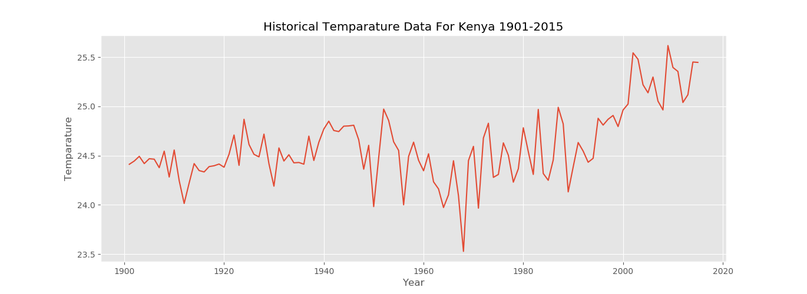

# KenyaTemp
My first attempt at data analytics with an aim to figure out how temperatures have changed over time(1901-2015).
This was achieved by using a dataset that is freely available at (http://sdwebx.worldbank.org/climateportal/index.cfm?page=country_historical_climate&ThisCCode=KEN).

I used the pandas library with matplot lib used to generate the graphs. The models generated may not be very accurate but its my first project dealing with data analytics and I hope to get better at it and generate even more accurate results.

I used Jupyter Notebook to write all the code but I have also included exported .py files.

Attached above is one of the graphs that I was able to generate.
